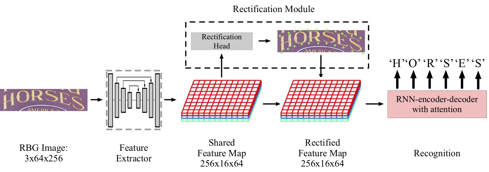
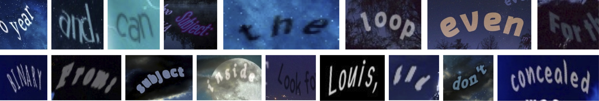
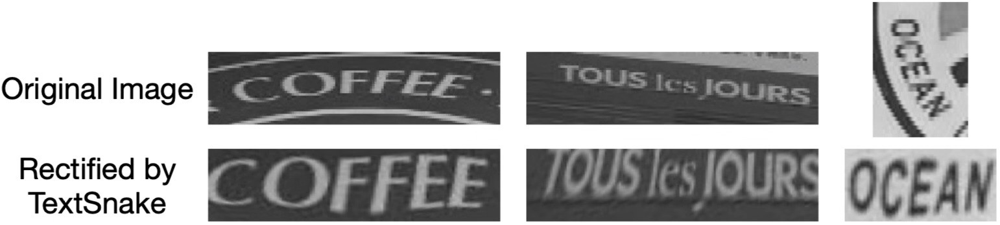

# ICDAR2019-ArT-Recognition-Code for PKU Team Zero

## Introduction

This is the code repository for our algorithm that **ranked No.1** on [__ICDAR2019 Robust Reading Challenge on Arbitrary-Shaped Text__](https://rrc.cvc.uab.es/?ch=14&com=introduction) (Latin scripts). Our team name is PKU Team Zero. 

For more technical details, please refer to our paper: [Rethinking Irregular Scene Text Recognition](https://arxiv.org/abs/1908.11834). We hope our efforts will act as a stepping stone to better recognition algorithms.



### Team
- Shangbang Long (龙上邦), master student at MLD CMU.
- Yushuo Guan (关玉烁), master student at EECS, Peking University.
- Bingxuan Wang (王炳宣), junior undergraduate student at Yuanpei College, Peking University.
- Kaigui Bian (边凯归), associate professor at EECS, Peking University.
- Cong Yao (姚聪), algorithm team leader at MEGVII (Face++) Inc.


## Competition Ranking

For full List, [click here](https://rrc.cvc.uab.es/?ch=14&com=evaluation&task=2).

| Method | Result | Total words | Correct words |
|:------:|:------:|:------:|:------:|
| __PKU Team Zero (ours)__ | 74.30% | 35284 | 26216 | 
| CUTeOCR | 73.91% | 35284 | 26078 |
| CRAFT (Preprocessing) + TPS-ResNet | 73.87% | 35284 | 26063 |
| serial_rec | 72.89% | 35284 | 25717 |

## Experiment Replication

### Environment
Find the enclosed environment file, and use the following command to install: 

`conda env create -f environment.yml`

You will need Anaconda to do so. 

### Data
In this section, we introduce how to prepare data for experiments. For download datasets and pretrained models, please refer to the `Pretrained Models and Data` section below.

All datasets should be placed under the `./dataset` folder. The data should be arranged as follows:

#### - File Tree

```
|-dataset
|    |-dataset_name
|         | Label.json
|         |-IMG
|                1. jpg
|                2. jpg
|                ...

```

#### - Label.json File
The Structure of `Label.json` should be:

```
[
    {
        "img": "IMG/x.jpg",
        "word": str,
        "poly_x": [int, int, int, ...], 
        "poly_y": [int, int, int, ...],
        "chars": list(list(list(int)))
    }
]
```

The attributes are:

- `img`: path of the image file
- `str`: text content of the image
- `poly_x`: x coordinates of the bounding polygon, if exists.
- `poly_y`: y coordinates of the bounding polygon, if exists.
- `chars`: a 3-D  2x4xN array (list) representing bounding boxes of N characters. The 3 dimensions are: x/y coordinates, 4 corners, N characters, if exists.


### How to Replicate the Experiments Presented in Our Paper:
You can refer to the paper for more details. To run experiments, find the training scripts under the corresponding folders, and **call from the root folder**, e.g. `bash Experiment/Experiment1/Exper_1_CRNN_all_synth.sh`.

#### Exp 1: 
Experiments W.R.T. new synthetic datasets as described in Section 3.1.2-3.1.3 can be found in `Experiment/Experiment1`. 

#### Exp 2:
Experiments W.R.T. mixing synthetic datasets and real world data as described in Section 3.2 can be found in `Experiment/Experiment2`. 

#### Exp 3&4:
Experiments with model modifications as described in Section 4 can be found in `Experiment/Experiment3` and `Experiment/Experiment4`. 

#### ICDAR 2019-ArT:
To replicate our ICDAR 2019 models, readers can use scripts in `Experiment/Experiment6`. 


## Pretrained Models and Data

### Pretrained Models
We select and release 3 representative models. Download from the link, unzip the file, and put the model files (ends with `pth.tar`) under th `pretrained_models` folder.

| Models | Link |
|------------|----------|
| <ul><li>*Rect* trained with *CurvedSynth* + *Synth90K*</li><li>*Rect* trained with *CurvedSynth* + *Synth90K* plus 15% real world data</li><li>*Rect* with squarization and random rotation, trained on synthetic data</li></ul> | [Link](https://shangbangblog.files.wordpress.com/2019/09/ic19_models.zip) |

The use of pretrained models is demonstrated in the following scripts:

- `./Experiment/Experiment1/Exper_1_STN_all_synth_test.sh`
- `./Experiment/Experiment2/Exper_2_STN_real_15_test.sh`
- `./Experiment/Experiment4/Exper_4_Square_flip_test.sh`

### Data
We will release all datasets we used, for the convenience of the research community. 

However, as they are large, we only release the following ones for now. We will update soon. 

| Dataset name | Description | Link |
|:----:|:----:|:----:|
| *RectTotal* | Total-Text rectified by TextSnake | [Google Drive](https://drive.google.com/open?id=1PYMAJA6zAvmjMpiPO5FXMmaj-vPVjQkC) | 
| *CurvedSynth*(now full) | The newly proposed synthetic dataset we used | [Google Drive](https://drive.google.com/open?id=1FSo-aaL8TbnRa3ChCMvMgHMp2DECB_1i) |

You can download and put these one under the `dataset` folder to start trying our code.


### Curved SynthText Engine



As is discussed in detail in the paper, the **Curved SynthText Engine** we modified from the original SynthText is our trump card. We also opensource this engine at [this repo](https://github.com/PkuDavidGuan/CurvedSynthText).

Using synthetic images from this engine, we can expect 10+\% improvement on Total-Text using a very simple algorithm. 

### RectTotal


We propose to evaluate algorithms on images rectified by TextSnake, as an investigation of key factors in text recognition. The TextSnake paper refers to the following one: 

```
@inproceedings{long2018textsnake,
  title={Textsnake: A flexible representation for detecting text of arbitrary shapes},
  author={Long, Shangbang and Ruan, Jiaqiang and Zhang, Wenjie and He, Xin and Wu, Wenhao and Yao, Cong},
  booktitle={Proceedings of the European Conference on Computer Vision (ECCV)},
  pages={20--36},
  year={2018}
}
```

We release the **Rectified Total-Text** (RectTotal) dataset for further research. 

## Citation
If our paper and code help you in your research and understand the text recognition better, you are highly encouraged (though not required) to cite our paper:

```
@article{long2019ArT,
  title={Alchemy: Techniques for Rectification Based Irregular Scene Text Recognition},
  author={Long, Shangbang and Guan, Yushuo and Wang, Bingxuan and Bian, Kaigui and Yao, Cong},
  journal={arXiv preprint arXiv:1908.11834},
  year={2019}
}
```
